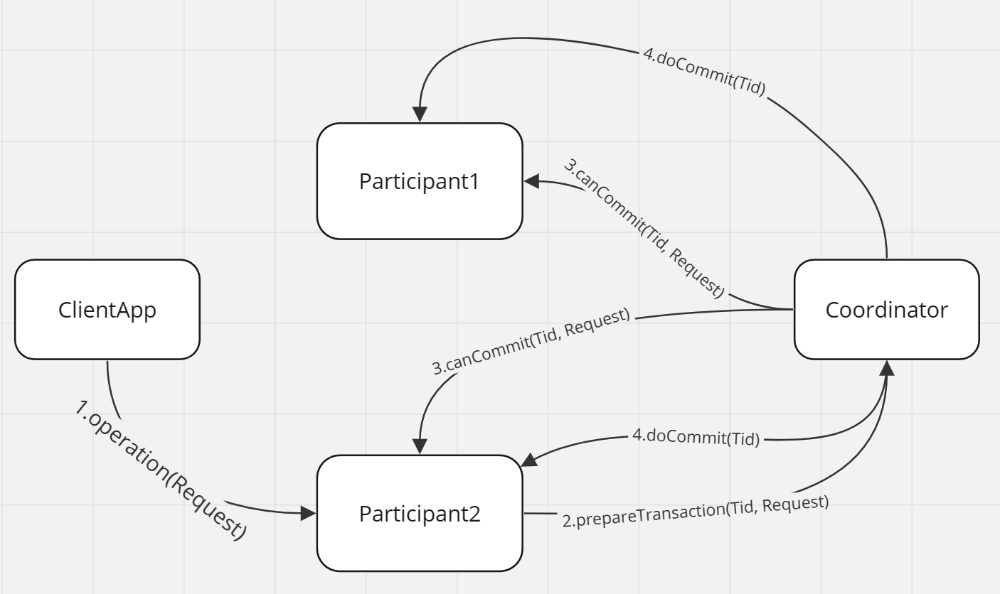

# Instruction
Follow the instructions bellow to start the gRPC server and client.

## Build(Optional)
***You can skip building by using the pre-generated `.jar` file provided***
* Unzip the compressed folder in your file system locally.
* Open the project in IDEA, press `ctrl` twice, run `mvn clean install`

## Run
1. If you skipped building, download the provided jar file to local file system then navigate to it in terminal, and go to step `3`
2. If you built, then you can run the server and client in two ways:
   1. In IDEA, click the start button for main function in `src/main/java/ServerApp` to run the server first, then start the client in `src/main/java/ClientApp`. Go to step `4`
   2. In command line, navigate to `~/CS6650_Project3/target`
3. Run `java -jar .\server.jar` to start the server. Open a new terminal session in the same directory, run `java -jar .\client.jar` to start a client
4. Follow the command line prompt to interact with client. Press `q` to stop the client, press `s` to switch replica connection, press `ctrl + c` on the server session to stop server 
5. Check out the log in dir `/logs/`

## Executive Summary
### Assignment Overview
This assignment expanded on the previous one made a step forward to replication control and agreement of servers. 
It requires student to dive deep into the topic of agreement and consensus in distributed system. To achieve agreement among
multiple replicas, students need to fully understand how 2-phase commit protocol works, as well as how to apply the protocol in
the real life coding. The project is also a decent practice of object-oriented programming, design pattern and framework implementation.

### Technical Impression
The usage of gRPC framework is inherited from the last assignment in this one. To achieve consistency with 2PC protocol, the server was split into
two parts: participant, as the replica, and coordinator.

*2PC workflow*

The image above is the simplified workflow of 2-phase commit protocol. 
1. Client arises an operation request by invoking the stub of one of the participant.
2. The participant inform the coordinator to prepare this transaction.
3. Coordinator asks each participant whether they can commit this request. Participant stores the request with its
tid locally and reply its vote.
4. If no participant's vote is negative, coordinator invoke each participant commit the transaction by tid.

In the implementation, since instances of participant and coordinator invoke method of each other, both need to maintain 
a stub and server for sending and receiving process call. The client app only need to talk to one participant each time and leave
the consistency handling to coordinator.